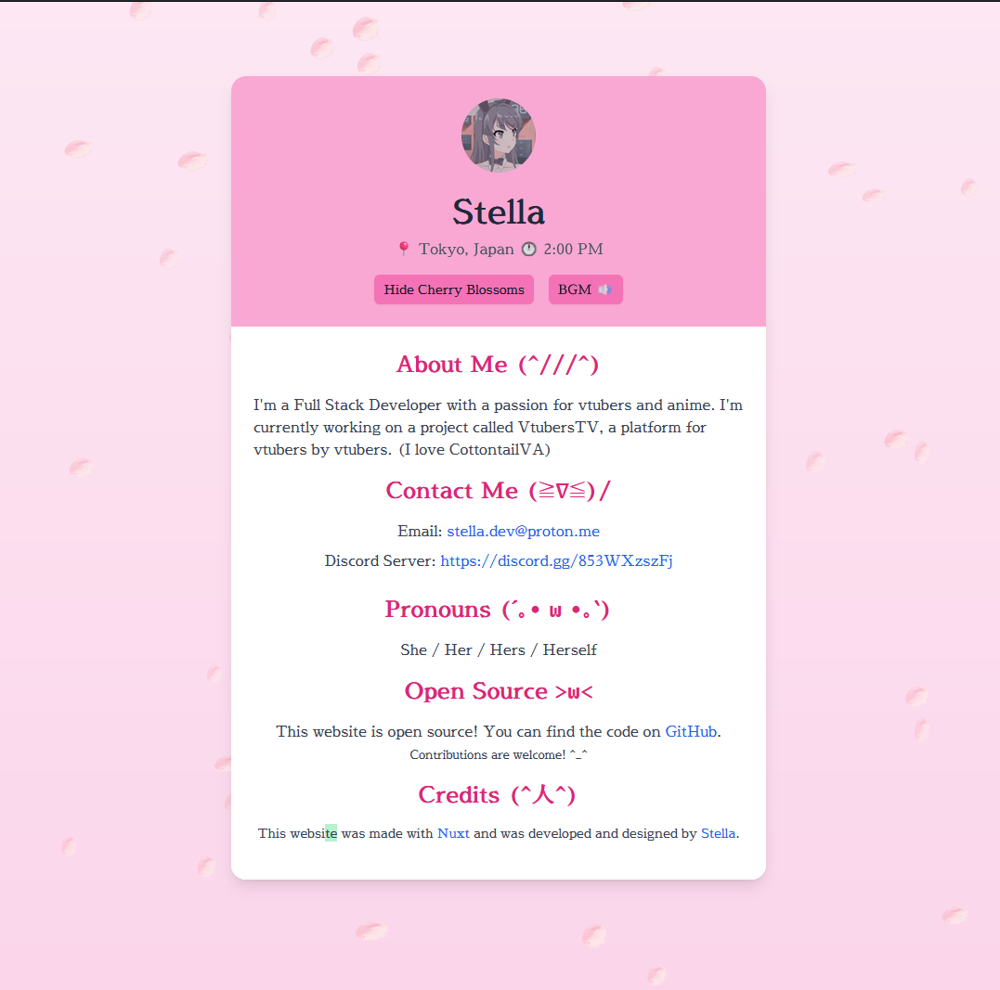

<h1 align="center">Website</h1>

This is my personal website. It is built using [NuxtJS](https://nuxt.com?ref=github/stellaOnEstrogen), a Web framework. The website is hosted on [Vercel](https://vercel.com/).

## Features

- **Customizable**: You can easily customize the website by editing the [`config.ts`](./config.ts) file.
- **Cute Design**: The website has a cute design, with a pastel color palette and a cute font.


## Development

To run the website locally, you need to have [Node.js](https://nodejs.org/) installed. Then, you can run the following commands:

```bash
# Install dependencies
$ npm install
```

Edit the [`config.ts`](./config.ts) file to add your personal information. Then, run the following command:

```bash
# Start the development server
$ npm run dev
```

The website will be available at `http://localhost:3000/`.

> [!IMPORTANT]  
> If you do decide to use this project as a personal website, please make sure to change the content in the `config.ts` file to your own information. **HOWEVER**, you are **NOT** allowed to remove the footer credit. You can change the text, but you must keep the link to this repository.

## TODO

- Add a blog section
- Add a projects section
- Add a contact form
- Add a image intergration

## License

This project is licensed under the MIT License - see the [LICENSE](./LICENSE) file for details.